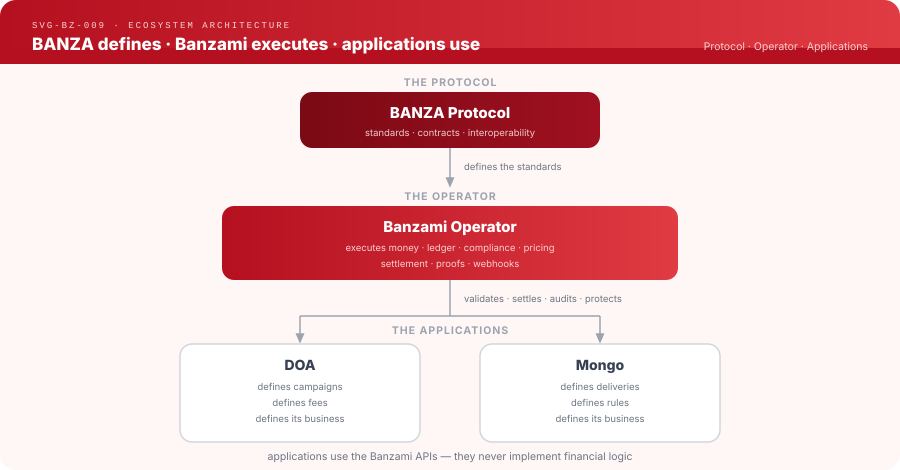
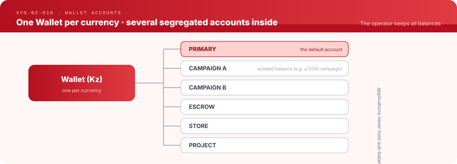
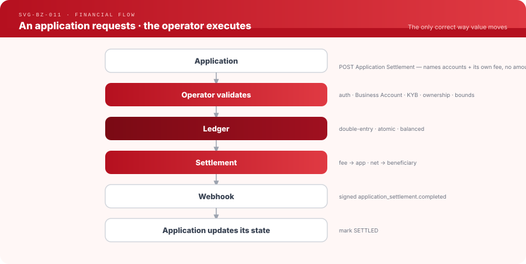
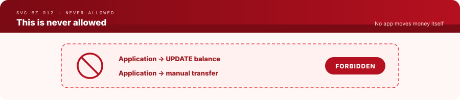
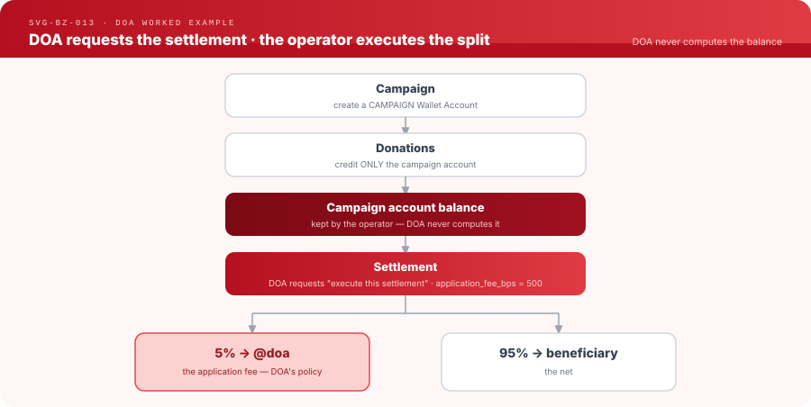
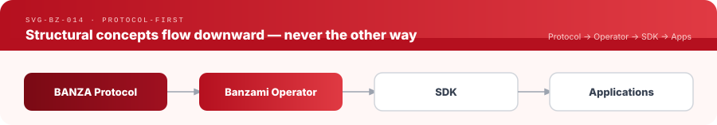
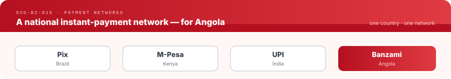

# Banzami is a BANZA Operator

**Banzami is an operator of the open [BANZA](#the-banza-ecosystem) protocol** — the
financial infrastructure that executes money for applications in Angola. It is the
layer that runs the ledger, the wallets, compliance, settlement, proofs and
webhooks, so that applications never have to.

> **Read this first.** Banzami is **not** an application, a wallet, a fintech for
> end users, a crowdfunding app, or a delivery app. Those are *applications* that
> sit on top of the operator. **Banzami is the financial operator they run on.**


| | |
|---|---|
| Role | Reference operator of the BANZA protocol |
| Website | [banzami.com](https://banzami.com) |
| Contact | contact@banzami.com |
| Repository | [github.com/banzami/banzami](https://github.com/banzami/banzami) — this repository |
| Protocol | [BANZA](https://github.com/banza-protocol/banza) — the open financial protocol |

---

## Strategic positioning

Read [Banzami — Posicionamento Competitivo em Angola](./docs/Banzami_Posicionamento_Competitivo_Angola.md) for the official strategic comparison with the Angolan payments market, the QR-without-TPA positioning, verifiable payment-proof model, and the BANZA ↔ Banzami ecosystem distinction.

It is a **strategic positioning and communication reference — target positioning, not a claim of production readiness or BANZA certification.** For real launch and certification status, see [Status](#status) and [BANZA protocol conformance](#banza-protocol-conformance) below.

---

## What is Banzami?

**Banzami is a BANZA Operator.** It implements the BANZA protocol and runs the
financial infrastructure — the ledger, wallets, pricing, settlement, compliance,
proofs and webhooks — that applications consume through APIs and SDKs.

What Banzami **is not**:

- ❌ a payments application
- ❌ a wallet
- ❌ a fintech for end users
- ❌ a crowdfunding application
- ❌ a delivery application

It is a **financial operator that implements the BANZA protocol**. Applications
like **DOA** (donations) and **Mongo** (commerce) run *on* Banzami; they are not
Banzami.

---

## The BANZA ecosystem

This is the **official architecture** of the ecosystem. Everything in this
repository serves the middle layer — the operator.



Three layers, three responsibilities: **the protocol defines, the operator
executes, the applications use.**

---

## The three layers

### BANZA Protocol — defines the standards

The protocol is the open specification. It defines:

- standards and contracts · interoperability · wallets · wallet accounts ·
  settlements · proofs · webhooks · security.

The protocol **never knows about**: DOA · Mongo · Marketplace · Delivery ·
Ticketing · Crowdfunding · campaigns · commercial rules · commercial fees · any
application. It defines *what is possible*, never *who uses it*.

Owned and governed independently at
[github.com/banza-protocol/banza](https://github.com/banza-protocol/banza).

### Banzami Operator — executes the money

The operator (**this repository**) implements the protocol and runs the
infrastructure. It is responsible for:

- Ledger · Wallets · Wallet Accounts · Pricing Engine · Operator Fees ·
  Application Settlement · Compliance · KYC · KYB · Receipts · Transaction Proofs ·
  QR Payments · Notifications · Audit · Webhooks · SDKs · APIs.

The operator **never defines**: campaigns · commercial rules · application prices ·
an application's business model. It validates, settles, audits and protects — it
does not invent the business.

### Applications — define the business

DOA · Mongo · Marketplace · Delivery · Ticketing · and any future app. Applications:

- define their business · define campaigns · define rules · define the user
  experience · define their commercial fees · consume the operator's APIs.

An application **never**: implements a ledger · implements proofs · implements
receipts · implements compliance · implements settlement · moves money. All
financial logic belongs exclusively to the operator.

---

## Fundamental Principle

> ### Applications define the business.
> ### The operator executes the money.
> ### The protocol defines the standards.

This is an **official rule** of the project.

---

## Golden Rule

> ## No client application may implement its own financial logic.

An application must **never**:

- calculate balances
- move money
- execute settlement
- generate receipts
- generate proofs
- validate payments
- hold sub-balances
- keep its own ledger

**All financial logic belongs exclusively to the Banzami operator.**

---

## Every monetised application is a Business Account

Any application that **receives money** through the operator must exist as a
**Business Account** inside Banzami (see
[ADR-028](docs/adr/ADR-028-application-business-account-requirement.md) and
[docs/architecture/business-accounts.md](docs/architecture/business-accounts.md)).

Examples: **DOA · Mongo · Marketplace · Delivery · Ticketing · NGO · Crowdfunding.**

Each one has, inside the operator:

- a **`@banza`** handle
- a **Business Account**
- a **Wallet** (per currency)
- **Wallet Accounts** (segregated balances)
- **KYB** approval
- **API keys**
- **Webhooks**
- **Application Settlement**

> **What is a `@banza`?** It is the Banzami handle — the name we give to a
> username (you pay `@maria`, not an IBAN). It is **not** the BANZA protocol;
> `@banza` is simply Banzami's word for "handle".

---

## Wallet Accounts

A Business Account holds **one Wallet per currency**. Inside a Wallet there are
several **Wallet Accounts** — segregated balances, each with its own ledger
account (see [ADR-027](docs/adr/ADR-027-wallet-accounts-operator-implementation.md)
and [docs/domains/wallet-accounts/](docs/domains/wallet-accounts/README.md)).



A Wallet Account is **not** a person, a merchant, or a consumer. It is **only a
financial segregation**. The operator keeps **all** balances; **applications never
hold sub-balances.** An app references a wallet account by id and asks the operator
for the balance — it never computes one.

---

## Operator Fee vs Application Fee

Two different fees, never confused (see
[ADR-029](docs/adr/ADR-029-application-defined-settlement-fees.md)).

| | **Operator Fee** | **Application Fee** |
|---|---|---|
| Defined by | the **operator** (Banzami) | the **application** |
| Configured in | Pricing Rules / BANZADMIN | the app's admin (DOA Admin, Mongo Admin, …) |
| Applied | on **every payment** | when it makes sense for that app (e.g. at settlement) |
| Operator's role | sets and charges it | **validates · executes · audits** — never sets the rate |

Application fees are the **app's** commercial policy:

| App | Application fee |
|-----|-----------------|
| DOA | 2% |
| Mongo | 12% |
| Marketplace | 15% |
| Ticketing | 8% |

The operator **validates, executes and audits** the fee. It **never decides an
application's commercial rate.**

---

## The financial flow

The only correct way value moves for an application:



This is **never** allowed:



An application **requests**; the operator **executes**.

---

## DOA — a worked example



DOA **never** calculates the balance and **never** distributes money. DOA only
asks the operator: *"execute this settlement."* The operator reads the real
balance, computes the split, posts the balanced ledger entries, and emits the
webhook. Full contract:
[docs/doa/settlement-contract.md](docs/doa/settlement-contract.md) ·
[docs/doa/readiness.md](docs/doa/readiness.md).

---

## Protocol-first

New **structural** financial/protocolar concepts originate in the protocol and
flow **downward**, never the other way:



Apps own UX and consume capabilities; the operator implements what the protocol
defines; the SDKs expose it. Apps and SDKs never invent new financial behaviour on
their own. See [docs/architecture/protocol-integration.md](docs/architecture/protocol-integration.md),
Banzami ADR-019, and BANZA ADR-035.

---

## Engineering architecture

Strict language boundaries enforce the rule that all financial logic lives in the
operator: **Rust** owns financial correctness, **Go** owns the API surface,
**PostgreSQL** is the single source of truth. The Rust core is the only writer of
financial state — no service above it can violate a financial invariant.


Every posting is double-entry and atomic, every balance is derived from the
ledger, and every operation is idempotent and replay-safe.

---

## What the operator enables

Because the operator runs all the financial infrastructure, applications get
instant Kwanza payments by calling one API and five SDKs — integration in hours,
not weeks.

| For | What the operator provides |
|-----|----------------------------|
| **Consumers** | a free Kwanza wallet with a human `@banza`; send/receive instantly; pay by QR |
| **Merchants** | accept payment with no terminal hardware; instant settlement; one dashboard |
| **Developers** | one API + five SDKs; typed clients, idempotency, signed webhooks, full sandbox |
| **Applications** | wallet-native payments, segregated funds, and app-defined settlement — without building any financial infrastructure |



---

## The BANZA ecosystem (repositories)

Banzami is the first commercial operator built on the BANZA protocol. BANZA
defines the open protocol; Banzami implements it. BanzAI is an adjacent protocol
knowledge system — it does not operate payments and is not part of the operator.


- **BANZA** — the open financial protocol, governed independently at
  [github.com/banza-protocol/banza](https://github.com/banza-protocol/banza).
- **BanzAI** — the protocol's knowledge system, at
  [github.com/banza-protocol/banzai](https://github.com/banza-protocol/banzai).

---

## Repository structure

| Directory | Contents |
|-----------|----------|
| `core/` | Rust financial core — ledger, wallets, wallet accounts, transfers, QR, settlement, payouts |
| `services/` | Go services — `api-gateway`, `public-api`, `admin-api`, and `common/documents` (shared [Document Engine](docs/document-engine.md)). A root `go.work` ties them together. |
| `apps/` | Product apps — mobile, merchant, dashboard, admin, pay, checkout, website |
| `sdk/` | Banzami integration SDKs — TypeScript, Flutter, Python, PHP, Go |
| `plugins/` | Commerce platform adapters |
| `db/` | PostgreSQL migrations |
| `infra/` | Docker, deployment, and monitoring |
| `docs/` | Operator documentation |
| `tools/` | Internal tooling |
| `evidence/` | Conformance and audit evidence artifacts (e.g. BANZA conformance reports) |
| `quality/` | Canonical operator assurance manifest (single source of truth for capability status) |
| `ops/` | Authoritative non-secret asset inventory (infrastructure, services, lifecycle) |
| `tests/` | Cross-cutting test harnesses spanning more than one zone (e.g. `tests/phase0/` E2E). Service-local unit tests live beside their code. |

---

## Release assurance

Every material Banzami capability is registered in the **canonical assurance
manifest**: [`quality/operator-assurance-manifest.yaml`](quality/operator-assurance-manifest.yaml).
The human-readable view, [`docs/quality/BANZAMI_OPERATOR_ASSURANCE.md`](docs/quality/BANZAMI_OPERATOR_ASSURANCE.md),
is generated from it — the manifest is authoritative and status is never
duplicated manually elsewhere.

**Standard for new capabilities:** before release, every new functional
capability must be (1) registered in the manifest with owner, environment
applicability, protocol/operator authority, and threat category; (2) covered
by the declared unit/integration/deployed-Sandbox-E2E and negative/security
test IDs; (3) gated (`deployment_gate`) and evidenced. Enforced by:

Two launch gates enforce the truth (a public capability may not pass the launch
gate on real-DB/audit evidence alone):

```bash
make check-assurance            # structural gate (part of make check-all)
make assure-reference           # Reference financial path readiness — PASS
make assure-sandbox-launch      # FULL external launch — HOLDs until every public
                                # surface is deployed-E2E released (12 pending)
make assure-mobile-ios          # iOS Simulator E2E (fail-closed until authored)
make check-live-fail-closed     # Live activation stays fail-closed
```

**Current state:** `Banzami Sandbox Reference Financial Path: GO` ·
`Banzami Full External Sandbox Launch: HOLD`. See the launch package for the
per-surface disposition.

The infrastructure/resource registry lives at
[`ops/asset-inventory.yaml`](ops/asset-inventory.yaml); the programme repair
log at [`docs/quality/REPAIR_LOG.md`](docs/quality/REPAIR_LOG.md); the testing
methodology at [`docs/quality/E2E_METHODOLOGY.md`](docs/quality/E2E_METHODOLOGY.md);
mobile E2E requirements at [`docs/quality/MOBILE_E2E_REQUIREMENTS.md`](docs/quality/MOBILE_E2E_REQUIREMENTS.md);
the Live activation gate at [`docs/operations/LIVE_ACTIVATION_GATE.md`](docs/operations/LIVE_ACTIVATION_GATE.md).
The Sandbox launch summary is
[`docs/quality/SANDBOX_LAUNCH_ASSURANCE_PACKAGE.md`](docs/quality/SANDBOX_LAUNCH_ASSURANCE_PACKAGE.md).

---

## Development

```bash
make dev-up        # start local infrastructure (PostgreSQL, Redis)
make db-migrate    # run database migrations
make core-run      # run the Rust financial core
make gateway-run   # run the API gateway
```

`make help` lists all targets. Full setup, service topology, and environment
configuration: [docs/](docs/).

---

## Documentation

All technical documentation lives in [docs/](docs/). Start at
[docs/DOCUMENTATION_MAP.md](docs/DOCUMENTATION_MAP.md). The architecture above is
the reference; these documents must never contradict it.

**Architecture & rules**
- [Business Accounts (the rule)](docs/architecture/business-accounts.md) · [ADR-028](docs/adr/ADR-028-application-business-account-requirement.md)
- [Protocol integration](docs/architecture/protocol-integration.md)
- [All ADRs](docs/adr/)

**Financial domains**
- [Wallet Accounts](docs/domains/wallet-accounts/README.md) · [ADR-027](docs/adr/ADR-027-wallet-accounts-operator-implementation.md)
- [Application Settlement](docs/domains/application-settlement/README.md) · [ADR-021](docs/adr/ADR-021-operator-fee-pricing-engine-and-application-settlement.md) · [ADR-029](docs/adr/ADR-029-application-defined-settlement-fees.md)
- [Pricing](docs/domains/pricing/README.md) · [Compliance](docs/domains/compliance/) · [Ledger](docs/domains/ledger/) · [Wallets](docs/domains/wallets/)

**Platform & operations**
- [Platform Status (ADR-024)](docs/adr/ADR-024-platform-status.md) · [Environment router (ADR-025)](docs/adr/ADR-025-platform-mode-environment-router.md)
- [Notifications (FCM)](docs/playbooks/fcm-push-notifications-flutter-ios.md)

**Applications**
- [DOA readiness](docs/doa/readiness.md) · [DOA ↔ Banzami settlement contract](docs/doa/settlement-contract.md)

---

## Status

Banzami is an **operator-side implementation aligned with the BANZA protocol**. It
does not own or govern the protocol (see [the ecosystem](#the-banza-ecosystem)).

It is in active development and **not yet launch-ready**. The financial core —
double-entry ledger, atomic postings, consumer wallets, balance derivation, P2P
transfers, and `@banza` handles — is implemented and validated against a real
database. QR payments, merchant apps, the Business Dashboard, and the SDK platform
are in progress. Real Kwanza funding and withdrawals — through an approved payment
rail such as EMIS or a partner-bank route — and KYC/KYB are not yet operational;
the default acquiring provider is simulated.

```text
Status:                         NOT YET launch-ready
Internal engineering blockers:  0
External blockers:              10
BANZA L0 dry-run evidence:      validated
BANZA certification:            not issued
Production federation:          not live
```

**Product roadmap**

| Horizon | Focus |
|---------|-------|
| **Now** | Wallets, wallet accounts, transfers, QR, payment links, application settlement, SDKs, sandbox |
| **Next** | Real Kwanza funding via an approved rail (EMIS or partner bank) · automated bank/rail payouts · PHP SDK v1 · production observability |
| **Later** | Broader merchant tooling, platform integrations, and network growth |

---

## Validation Studio and Implementation Matrix

The **Validation Studio** is Banzami's readiness control room. It tracks every
implementation domain, launch blocker, external dependency, roadmap item, and
piece of validation evidence — and it deliberately keeps "implemented" separate
from "launch-ready". It is the source of truth for current Banzami readiness.

- Source of truth: [`docs/validation/BANZAMI_IMPLEMENTATION_MATRIX.json`](docs/validation/BANZAMI_IMPLEMENTATION_MATRIX.json)
- App: [`apps/validation-studio/`](apps/validation-studio/) — `make studio` (local-only)

**Current snapshot**

```text
Total tracked:     87
Launch scope:      76
Launch-ready:      66/76
Code-complete:     68/76
Internal blockers:  0
External blockers: 10
Launch status:     NOT YET
```

What the figures mean:

- **Launch-ready** — VALIDATED against real evidence (production-proven for its scope).
- **Code-complete** — VALIDATED or IMPLEMENTED (internal engineering done).
- **Internal blockers** — not launch-ready for reasons still under Banzami's own engineering control.
- **External blockers** — blocked by a dependency outside Banzami's engineering control (KYC/KYB vendor, money-in/out rails, BNA / regulatory).
- **Roadmap** — tracked future scope (e.g. BANZA L1–L4); **not** a launch blocker.

---

## Why the matrix matters

The matrix is a governance and readiness instrument, not a marketing dashboard. It
answers: what is implemented, what is validated, what is blocked, what is external,
and what must not yet be claimed. It:

- prevents false readiness claims;
- shows what is done, blocked, or future;
- documents evidence for each validated item;
- creates an auditable governance trail (every VALIDATED status carries a fingerprint, approver, and commit);
- separates code completion from business launch readiness.

---

## BANZA protocol conformance

Banzami runs the **official BANZA conformance suite** against its sandbox
(`https://sandbox-operator.banzami.com`) as an **operator candidate**. The current
result is **Level 0, 5/5 passed**, cross-validated on two distribution channels:

- PyPI: `banza-conformance==0.1.0`
- GHCR: `ghcr.io/banza-protocol/banza-conformance:v0.1.0`

The report is archived at
[`evidence/banza-conformance/l0/banzami-sandbox-l0-report.json`](evidence/banza-conformance/l0/banzami-sandbox-l0-report.json)
(see the [evidence README](evidence/banza-conformance/l0/README.md)).

**PASS means conformance evidence, not certification.** The BANZA protocol owns
the certification framework; no production certificate is issued or served
(`/.well-known/banza/certificate.json` is intentionally absent), and Banzami is
not in any production operator registry. Production certification is gated on later
operator milestones (real rails, KYC/KYB, production keys), none complete.

Reproduce the L0 run:

```bash
# Convenience wrapper (auto-detects the PyPI CLI or Docker)
make banza-conformance-l0

# Official PyPI tool
pip install banza-conformance==0.1.0
banza-conformance \
  --url https://sandbox-operator.banzami.com \
  --level 0 \
  --output evidence/banza-conformance/l0/banzami-sandbox-l0-report.json
```

### BANZA Level Roadmap

| Level | Meaning | Banzami status | Evidence / next step |
|-------|---------|----------------|----------------------|
| **L0** | Sandbox protocol conformance | **VALIDATED baseline** | archived L0 evidence (PyPI + GHCR 5/5) |
| **L1** | Core payments | PLANNED | gap analysis required |
| **L2** | Payment initiation | FUTURE | not started |
| **L3** | Federation | FUTURE / M2–M3 gated | requires BANZA CA certificate and production trust |
| **L4** | External interoperability | FUTURE | profile-defined |

Levels and rules are defined by BANZA, not by Banzami — see the protocol's
`BANZA_CERTIFICATION.md` and [docs/certification.md](docs/certification.md). L1–L4
are roadmap; none are validated and none imply certification.

---

## What this does not mean

- Banzami is **not** a certified BANZA operator.
- Banzami has **not** received a BANZA production certificate.
- L0 PASS is **not** certification — it is dry-run conformance evidence.
- L1 / L2 / L3 / L4 are **not** validated.
- Production federation is **not** live.
- Conformance does **not** replace legal, regulatory, KYC/KYB, AML-CFT, banking, or licensing obligations.

---

## Useful commands

```bash
make studio                # Validation Studio — local readiness control room (:3099)
make banza-conformance-l0  # Run BANZA L0 conformance against the sandbox (evidence)
make check-repo-layout     # Repository layout compliance check
make dev-up                # Start local infrastructure (PostgreSQL, Redis)
make db-migrate            # Run database migrations
```

---

## Contributing

See [CONTRIBUTING.md](CONTRIBUTING.md).

## License

See [LICENSE](LICENSE).
