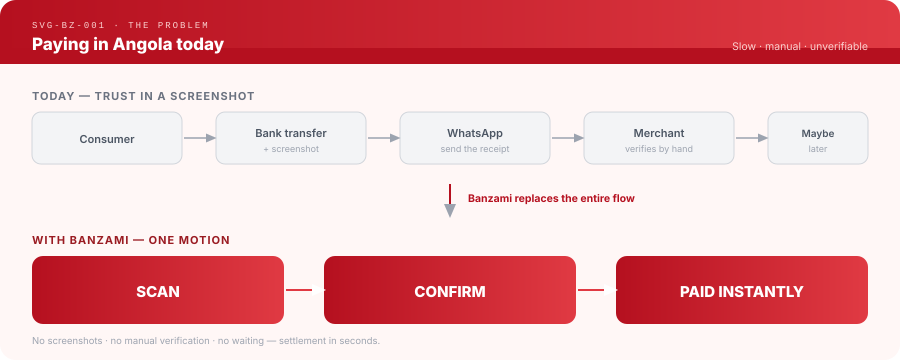
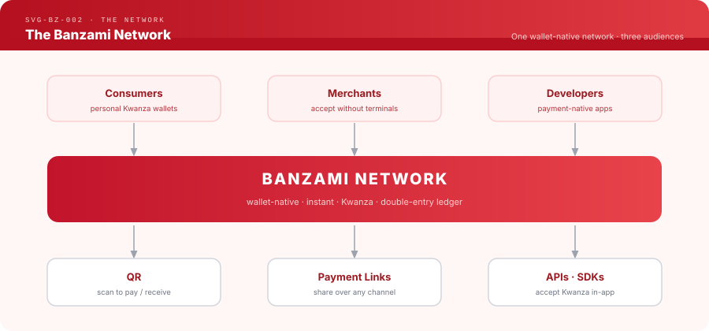
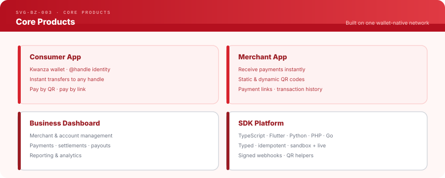
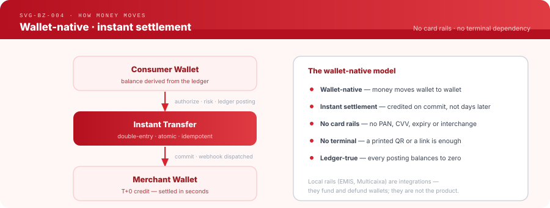
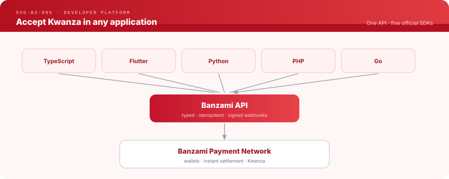
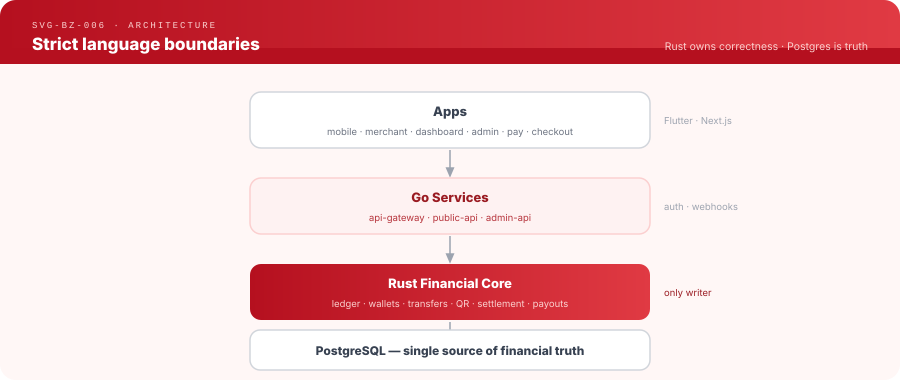
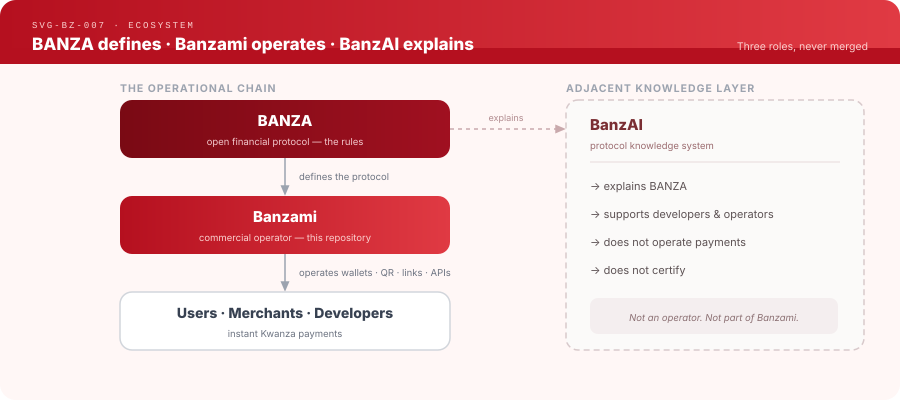

**Angola's wallet-native payment network.** Banzami is the **first operator
built on the open BANZA protocol** — an independent Angolan startup building the
network that moves Kwanza at internet speed, where every account is a wallet,
every payment is an instant transfer, and money settles in seconds without cash,
cards, terminals, or proof-of-payment screenshots.

> **Money moves at internet speed.**


| | |
|---|---|
| Network | Angola's wallet-native payment network |
| Website | [banzami.com](https://banzami.com) |
| Contact | contact@banzami.com |
| Repository | [github.com/banzami/banzami](https://github.com/banzami/banzami) — this repository |
| Built on | [BANZA](https://github.com/banza-protocol/banza) — the open financial protocol |

---

## Overview

Banzami is **infrastructure first**. It is not a wallet app, a QR app, or a
payment-link app — those are products that sit on top of the network. Banzami
is the network itself: a real-time, wallet-native settlement layer for Kwanza,
addressable by human-readable `@handles`, accessible through QR codes, payment
links, and developer SDKs.

```
Pix      → Brazil
M-Pesa   → Kenya
UPI      → India
Banzami  → Angola
```

Banzami is the first operator built on the open [BANZA](#ecosystem) protocol.

---

## The Problem

Today, paying another person or a merchant in Angola is slow, manual, and built
on trust in a photo of a receipt. Cash fills the gap, with all its cost and risk.
Banzami replaces the entire flow with one motion: **scan, confirm, paid.**



---

## The Banzami Network

Consumers, merchants, and developers connect to a single wallet-native network.
Money never leaves the ledger; it moves between wallets in real time. Every
participant holds a wallet, and QR codes, payment links, and SDKs are simply
different ways to initiate the same transfer.



---

## Core Products



---

## How Money Moves

Banzami is **wallet-native**. There are no card rails and no dependency on
physical POS terminals (TPA). A payment is a ledger movement between two wallets,
and the merchant is credited the moment the transfer commits.



The financial core enforces correctness: every posting is double-entry and
atomic, every balance is derived from the ledger, and every operation is
idempotent and replay-safe.

---

## Developer Platform

Any Angolan application — a taxi app, a delivery platform, an e-commerce store,
a donation platform — accepts instant Kwanza through one API and five official
SDKs. Integration takes hours, not weeks.



---

## Architecture

Strict language boundaries: Rust owns financial correctness, Go owns the API
surface, PostgreSQL is the single source of truth. The Rust core is the only
writer of financial state — no service above it can violate a financial invariant.



---

## Why Banzami

### For consumers
A free Kwanza wallet with a human `@handle`. Send and receive money instantly,
pay any merchant by scanning a QR — no cash, no IBAN, no card.

### For merchants
Accept payments with zero terminal hardware. Print a QR or share a link, receive
money in seconds, and manage everything from one dashboard with instant settlement.

### For developers
One API and five SDKs to accept Kwanza natively inside any app. Typed clients,
idempotency, signed webhooks, and a full sandbox — from `install` to first
payment in minutes.

### For platforms
Marketplaces, delivery apps, and e-commerce platforms embed wallet-native
payments and instant settlement directly into their product, in Kwanza, without
building payment infrastructure.

---

## National Impact

Banzami exists to make digital Kwanza payments the default in Angola.

| Lever | Effect |
|-------|--------|
| **Financial inclusion** | A wallet for anyone with a phone — no bank branch, no card |
| **Digital commerce** | Any merchant accepts digital payment without a terminal |
| **Instant payments** | Settlement in seconds replaces manual transfers and cash |
| **QR economy** | A printed QR turns any counter into a point of sale |
| **SDK economy** | Local developers build payment-native apps on shared rails |

Less cash in circulation, fewer manual confirmations, and a payment surface
every Angolan application can build on.

---

## Ecosystem

Banzami is the first commercial operator built on the BANZA protocol. BANZA
defines the open protocol; Banzami implements it as a wallet-native payment
network. BanzAI is an adjacent protocol knowledge system that helps developers
and operators understand the protocol — it does not operate payments and is not
part of the Banzami operator.



**BANZA** — the open financial protocol, owned and governed independently at
[github.com/banza-protocol/banza](https://github.com/banza-protocol/banza).
**BanzAI** — the protocol's knowledge system, at
[github.com/banza-protocol/banzai](https://github.com/banza-protocol/banzai).

---

## Repository Structure

| Directory | Contents |
|-----------|----------|
| `core/` | Rust financial core — ledger, wallets, transfers, QR, settlement, payouts |
| `services/` | Go services — `api-gateway`, `public-api`, `admin-api` |
| `apps/` | Product apps — mobile, merchant, dashboard, admin, pay, checkout |
| `sdk/` | Banzami integration SDKs — TypeScript, Flutter, Python, PHP, Go |
| `plugins/` | Commerce platform adapters |
| `db/` | PostgreSQL migrations |
| `infra/` | Docker, deployment, and monitoring |
| `docs/` | Operator documentation |
| `tools/` | Internal tooling |

---

## Development

```bash
make dev-up        # start local infrastructure (PostgreSQL, Redis)
make db-migrate    # run database migrations
make core-run      # run the Rust financial core
make gateway-run   # run the API gateway
```

`make help` lists all targets. Full setup, service topology, and environment
configuration: [docs/](docs/).

---

## Documentation

All technical documentation lives in [docs/](docs/) — architecture, domains,
runbooks, security, sandbox, and integration guides. Start at
[docs/DOCUMENTATION_MAP.md](docs/DOCUMENTATION_MAP.md).

---

## Status

Banzami is in active development and **not yet production-ready**. The financial
core — double-entry ledger, atomic postings, consumer wallets, balance derivation,
P2P transfers, and `@banza` handles — is implemented and validated against a real
database. QR payments, merchant apps, the Business Dashboard, and the SDK platform
are in progress. Real Kwanza funding and withdrawals (EMIS) and KYC are not yet
operational; the default acquiring provider is simulated.

**Roadmap**

| Horizon | Focus |
|---------|-------|
| **Now** | Wallets, transfers, QR, payment links, SDKs, sandbox |
| **Next** | EMIS acquiring (real Kwanza funding) · automated bank payouts · PHP SDK v1 · production observability |
| **Later** | Broader merchant tooling, platform integrations, and network growth |

---

## Contributing

See [CONTRIBUTING.md](CONTRIBUTING.md).

## License

See [LICENSE](LICENSE).
