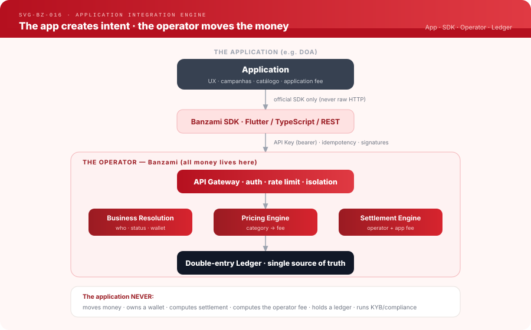
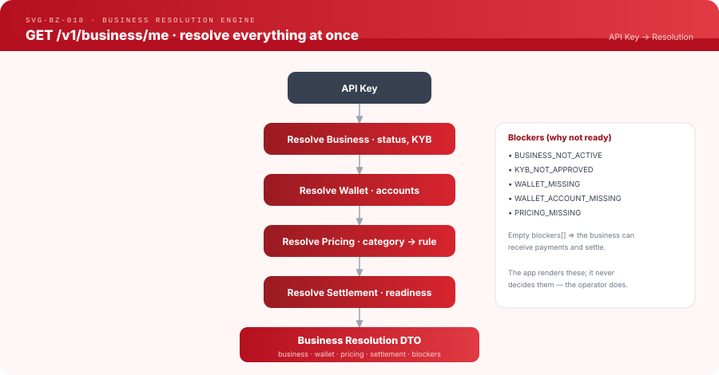
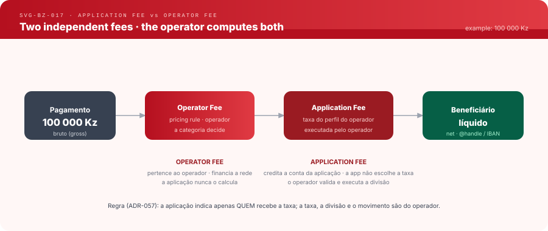

# Application Integration Engine — how any application integrates with Banzami

**Status:** Implemented · **Version:** 1.0 · **Audience:** internal engineers,
partners, first-party apps, `developers.banzami.com`

> This is the **canonical reference** for integrating an application with the
> Banzami operator. It supersedes ad-hoc knowledge: nothing here is implicit.
> Every responsibility is separated. The worked example throughout is **DOA**
> (`~/doa`) — the reference integration.

Related engines (each has its own document): [business-resolution-engine.md](business-resolution-engine.md) ·
[pricing-resolution-engine.md](pricing-resolution-engine.md) ·
[settlement-resolution-engine.md](settlement-resolution-engine.md) ·
[authentication-engine.md](authentication-engine.md) ·
[integration-lifecycle.md](integration-lifecycle.md).
Governing decision: [ADR-032](../adr/ADR-032-application-integration.md).

---

## 1. Overview

An application never touches money. It creates **intent** (a payment to collect,
a campaign to fund, an order to charge) through an official SDK; the **operator**
(Banzami) resolves the business, prices it, moves the money on the double-entry
ledger, and settles it. The application only reflects operator state.



```
Application
    │  official SDK only (never raw HTTP)
    ▼
Banzami SDK  (Flutter / TypeScript / REST)
    │  API Key (bearer) · idempotency · signatures
    ▼
API Gateway            auth · rate limiting · business isolation
    ▼
Business Resolution Engine     who · status · wallet · accounts
    ▼
Pricing Engine                 business category → fee
    ▼
Settlement Engine              operator fee + application fee → payout
    ▼
Ledger                         double-entry · single source of truth
```

The protocol/operator/application split is fixed (see [ADR-025](../adr/ADR-025-platform-mode-environment-router.md)
and [protocol-integration.md](protocol-integration.md)): **BANZA** defines the
rules, **Banzami** executes them, **applications** consume them.

---

## 2. What is an integrated application?

An integrated application (DOA, a marketplace, a school, a delivery app):

**NEVER**
- moves money
- owns a wallet
- computes settlement
- computes the **operator** fee
- holds a ledger
- runs KYB / KYC / compliance / risk

**ONLY**
- creates requests (payment sessions, collections, split bills)
- presents information resolved by the operator
- defines its own **application fee**

> **All the money belongs to the operator.** The application holds a *reference*,
> never a balance. This is enforced by [ADR-028](../adr/ADR-028-application-business-account-requirement.md)
> (an application acts through a real Business account) and the ledger design in
> [money-engine.md](money-engine.md).

---

## 3. Responsibilities (the hard boundary)

| Concern | Application | Operator (Banzami) |
|---|---|---|
| UX / branding | ✔ owns | ✘ |
| Campaigns / catalogue / orders | ✔ owns | ✘ |
| Business logic (who to charge, when) | ✔ owns | ✘ |
| **Application fee** (its own cut, in bps) | ✔ defines | ✔ executes |
| Money movement | ✘ | ✔ owns |
| Wallet + sub-accounts | ✘ | ✔ owns |
| Pricing / **operator fee** | ✘ | ✔ owns |
| KYB / KYC / compliance / risk | ✘ | ✔ owns |
| Ledger + settlement + payout | ✘ | ✔ owns |
| Audit trail + proofs | ✘ | ✔ owns |

If a task is on the operator side, the application **cannot** perform it even if
it wanted to — the API surface does not expose it. The application receives
*resolved facts* (see §4) and *reference ids*, never raw financial primitives.

---

## 4. Business Resolution Engine

One API key in → a fully-resolved business out, in a single call:
`GET /v1/business/me`. Full field-by-field spec: [business-resolution-engine.md](business-resolution-engine.md).



```
API Key
   ↓  resolve business   (identity, status, KYB)
   ↓  resolve wallet      (+ sub-accounts, balances)
   ↓  resolve pricing     (category → rule → fee)
   ↓  resolve settlement  (readiness)
   ↓
Business Resolution DTO
```

The app calls this on launch and on a short poll (e.g. every 30 s) and renders
whatever it returns — it never derives status, pricing or readiness itself.

---

## 5. Pricing Resolution

The application **never chooses a fee**. The business *category* chooses it.

```
Business Category   (e.g. donation, retail, services)
      ↓  taxonomy map
Pricing Category
      ↓  active pricing rule (+ transaction_type dimension, ADR-031)
Pricing Rule
      ↓
Operator Fee
```

Full detail: [pricing-resolution-engine.md](pricing-resolution-engine.md),
[pricing-mapping.md](pricing-mapping.md), [business-taxonomy.md](business-taxonomy.md),
[ADR-031](../adr/ADR-031-transaction-type-pricing-dimension.md).

> DOA does not pick its operator fee. Its category (`donation` →
> `DONATION` pricing category) does. Changing DOA's fee means changing the
> *category rule* in the operator — never a value in the DOA app.

---

## 6. Settlement

The application requests a settlement and supplies its **application fee**; the
operator validates the beneficiary, computes both fees, posts the ledger and pays
out. Full detail: [settlement-resolution-engine.md](settlement-resolution-engine.md),
[ADR-029](../adr/ADR-029-application-defined-settlement-fees.md).


```
Application → Operator → Ledger → Settlement → Bank/rails → Beneficiário
```

Funds received into a segregated sub-account (e.g. a campaign account,
[ADR-027](../adr/ADR-027-wallet-accounts-operator-implementation.md)) are **held**
until close, then settle to the beneficiary. Terminal state is driven by the
operator via `application_settlement.completed | failed | cancelled` webhooks.

---

## 7. Application Fee ≠ Operator Fee

Two **independent** fees, both computed by the operator:



```
100 000 Kz (gross)
   → Operator Fee     pricing rule · the category decides · belongs to the operator
   → Application Fee  bps chosen by the app · executed by the operator
   → Beneficiário     net (@handle / IBAN)
```

- **Operator fee** funds the network. The application never calculates it.
- **Application fee** funds the application. The app chooses the bps
  (`application_fee_bps`); the operator validates and executes the split.

Neither fee is ever computed client-side. The app sends `application_fee_bps`;
everything else is the operator's.

---

## 8. Business Resolution DTO

`GET /v1/business/me` returns (canonical fields — see
[business-resolution-engine.md](business-resolution-engine.md) for types):

| Group | Fields |
|---|---|
| `business` | `handle`, `name`, `account_type`, `status`, `category`, `subcategory` |
| `pricing` | `pricing_category`, active rule (fee bps / fixed), `transaction_type` |
| `wallet` | `wallet_id`, `currency`, `available_minor`, `reserved_minor`, `held_minor`, `total_minor` |
| `accounts` | sub-accounts (`purpose`, `label`, `reference`, `status`, `available_balance_minor`) |
| `settlement` | `settlement_ready` (bool), method/readiness |
| `blockers` | `[]` reason codes (empty ⇒ ready) — see §9 |
| `environment` | `SANDBOX` / `LIVE` |

`held_minor` is the sum of the wallet's non-PRIMARY sub-account balances
(money received but not spendable — e.g. campaign funds awaiting settlement).
Sub-accounts are listed via `GET /v1/business/wallet-accounts`.

---

## 9. Blockers

Each blocker is an operator-decided reason the business cannot yet transact.
The app renders them; it never invents or clears them.

| Blocker | Meaning | How the app resolves it |
|---|---|---|
| `BUSINESS_NOT_ACTIVE` | Account not active | Wait / complete onboarding in the operator |
| `KYB_NOT_APPROVED` | KYB pending/rejected | Submit / await KYB ([kyb-merchant-verification.md](kyb-merchant-verification.md)) |
| `WALLET_MISSING` | No wallet for the currency | Operator provisions it on activation |
| `WALLET_ACCOUNT_MISSING` | No destination sub-account | Create the purpose account (e.g. campaign) |
| `PRICING_MISSING` | No active pricing rule for the category | Operator assigns a category rule |

Empty `blockers[]` ⇒ the business can receive payments and settle.

---

## 10. Complete flow


```
Create Business → KYB → Wallet(+accounts) → Pricing → Application
      → Receber pagamento → Settlement → Beneficiário
```

Every step is gated by Business Resolution (§4). Detail per stage:
[integration-lifecycle.md](integration-lifecycle.md).

---

## 11. Security

- **API Key**: server-side secret keys only (never in frontend/mobile client
  code); publishable keys for clients. Exchanged for a short-lived JWT by the SDK.
- **Scopes**: a key is bound to exactly one Business; the gateway enforces
  **business isolation** (a key can only touch its own wallet/accounts).
- **Rate limiting** + **idempotency** on every mutating call (idempotency key).
- **Replay protection** on webhooks via the `banza-signature` header
  (`BANZA_WEBHOOK_SECRET`) — verify with the SDK, never by hand.
- **Structured logs + immutable audit trail** on the operator side.

See [security/](../security/) and [authentication-engine.md](authentication-engine.md).

---

## 12. Environments

| Environment | Host | Keys | Money |
|---|---|---|---|
| **Sandbox** | `sandbox-api.banzami.com` | `bz_test_*` | test only — no real value |
| **Live** | `api.banzami.com` | `bz_live_*` | real |

Never mix. A sandbox key against a live host (or vice-versa) is rejected. The
platform-mode env router is [ADR-025](../adr/ADR-025-platform-mode-environment-router.md).
(“Preview” is an operator-internal staging concept, not an app-facing environment.)

---

## 13. Errors

Standard error hierarchy (structured `{ code, message, request_id }`):

| Code | Motivo | Como resolver |
|---|---|---|
| `UNAUTHORIZED` | Missing/invalid API key or JWT | Re-authenticate via the SDK |
| `FORBIDDEN` | Key not owner of the target resource | Use the correct business's key |
| `BUSINESS_NOT_ACTIVE` | Business not active | See §9 |
| `KYB_NOT_APPROVED` | KYB not approved | See §9 |
| `WALLET_ACCOUNT_MISSING` | No destination sub-account | Create the purpose account |
| `PRICING_MISSING` | No pricing rule for the category | Operator assigns a category rule |
| `INVALID_AMOUNT` | Amount ≤ 0 / missing on open link | Send a positive `amount_minor` |
| `NO_WALLET` | Payer has no wallet in the currency | Payer creates a wallet first |
| `INSUFFICIENT_FUNDS` | Payer balance too low | Payer tops up |
| `UPSTREAM_ERROR` | Transient operator/core error | Retry with the same idempotency key |

Every error carries `request_id` for support/audit. Never surface raw internals
to end-users; map to friendly copy.

---

## Appendix — diagrams

New (this document): `banzami-application-integration-v1.svg`,
`banzami-application-fee-v1.svg`, `banzami-business-resolution-v1.svg`,
`banzami-settlement-flow-v1.svg`, `banzami-integration-lifecycle-v1.svg`.
Reuse: `banzami-ecosystem-architecture-v1.svg`, `banzami-money-flow-v1.svg`,
`banzami-wallet-accounts-v1.svg`, `banzami-doa-example-v1.svg`.
All SVG, `SVG-BZ-*` numbered, same visual language as the README.
