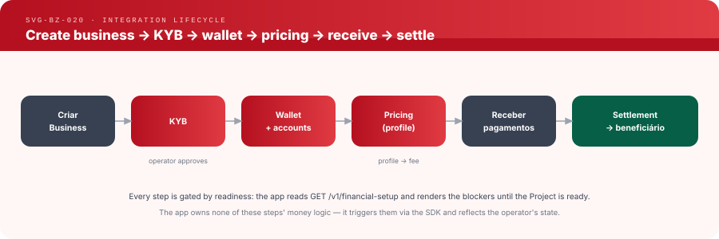

# Integration Lifecycle — from a new Project to settlement

**Status:** Implemented · **Version:** 1.0 · **Part of:**
[application-integration-engine.md](application-integration-engine.md) ·
**Decisions:** [ADR-032](../adr/ADR-032-application-integration.md),
[ADR-057](../adr/ADR-057-project-financial-readiness.md)



> The diagram predates ADR-057 and still shows the app polling
> `GET /v1/integration`; the text below is authoritative.

```
Create Project + Financial Setup → KYB → Wallet(+accounts) → Pricing profile
      → Application → Receber pagamento → Settlement → Beneficiário
```

Every stage is **gated by financial readiness** (`GET /v1/financial-setup`, SDK
`getFinancialSetup()`): the app reads it with its Project key and renders
`settlement.blockers[]` until the Project is ready. Readiness is computed by core
with the same functions settlement calls, so each blocker is the refusal a
settlement would return. The app owns none of these stages' money logic — it
triggers them via the SDK and reflects state.

(`GET /v1/integration` is the merchant session's own dashboard view, not this
gate; a Project key there gets 403 `USE_FINANCIAL_SETUP` —
[business-resolution-engine.md](business-resolution-engine.md).)

## Stages

1. **Create Project + Financial Setup** — the Project is bound to a financial
   owner, a real Business Account
   ([ADR-047](../adr/ADR-047-project-merchant-binding-for-developer-payment-capabilities.md),
   [ADR-028](../adr/ADR-028-application-business-account-requirement.md)).
   Until then: `financial_setup.state = UNCONFIGURED`, blocker
   `FINANCIAL_SETUP_NOT_CONFIGURED` (a 200 state, not an error). The binding is
   sealed on the first payment artifact (`state = SEALED`,
   [ADR-055](../adr/ADR-055-project-binding-seal-on-first-payment-artifact.md)).
2. **KYB** — the operator verifies the business
   ([kyb-merchant-verification.md](kyb-merchant-verification.md)); reported as
   `kyb.status`. (Sandbox auto-approves.)
3. **Wallet (+ sub-accounts)** — the operator provisions a wallet; the app
   creates purpose sub-accounts as needed (e.g. one `CAMPAIGN` account per
   campaign, [ADR-027](../adr/ADR-027-wallet-accounts-operator-implementation.md)).
   Blocker: `WALLET_MISSING`.
4. **Pricing profile** — the operator assigns a pricing profile (a self-service
   Sandbox Project receives `sandbox-default`: settlement 0 bps, payout 75 bps;
   see [pricing-resolution-engine.md](pricing-resolution-engine.md)). Blockers:
   `PRICING_NOT_CONFIGURED`, `PRICING_CONFIGURATION_ERROR`. If the profile's
   settlement fee is greater than zero, the fee destination must pass ADR-028,
   including an operator classification as `APPLICATION` / `PLATFORM`
   (`FEE_DESTINATION_*` blockers); on a zero-rate profile it blocks nothing.
5. **Application** — with `settlement.blockers[]` empty, the app can operate:
   create payment sessions ([ADR-030](../adr/ADR-030-payment-sessions.md)),
   collections, split bills, QR ([qr-engine.md](qr-engine.md)).
6. **Receber pagamento** — the payer pays through any provisioned interface
   (link / QR / deep link); the operator credits the destination sub-account
   gross and emits `payment_session.paid`.
7. **Settlement** — the app requests close, names the beneficiary and, when a fee
   is due, the fee destination; it sends **no rate** (a pricing field is refused
   with 400 `PRICING_FIELD_NOT_ACCEPTED`). The operator prices the settlement from
   the assigned profile, posts the ledger and pays the beneficiary
   ([settlement-resolution-engine.md](settlement-resolution-engine.md),
   [ADR-057](../adr/ADR-057-project-financial-readiness.md)).

## Readiness contract

`settlement.ready == true` (equivalently `settlement.blockers == []`) ⇒ every
deterministic prerequisite the settlement path checks passes. What cannot be
known in advance — a source account's balance, the beneficiary a request will
name — is checked by each settlement. Anything else ⇒ the app shows the blocker
and waits; it does not attempt to work around the operator.

> **Historical.** Before ADR-057 this lifecycle was gated by `GET /v1/integration`
> (blockers `BUSINESS_NOT_ACTIVE`, `KYB_NOT_APPROVED`, `WALLET_ACCOUNT_MISSING`,
> `PRICING_MISSING`), priced by business category, and settled with an
> app-defined `application_fee_bps` (ADR-029, superseded).
