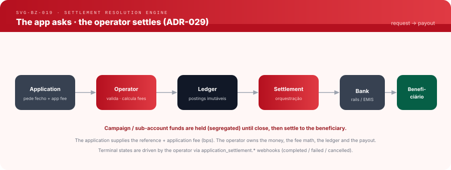

# Settlement Resolution Engine — how the operator settles to a beneficiary

**Status:** Implemented · **Version:** 1.0 · **Part of:**
[application-integration-engine.md](application-integration-engine.md) ·
**Decisions:** [ADR-057](../adr/ADR-057-project-financial-readiness.md) (supersedes
ADR-029), [ADR-028](../adr/ADR-028-application-business-account-requirement.md),
[ADR-027](../adr/ADR-027-wallet-accounts-operator-implementation.md)

## The flow




```
Application → Operator → Ledger → Settlement → Bank/rails → Beneficiário
```

0. **Before offering a settlement**, the application reads
   `GET /v1/financial-setup` (`getFinancialSetup()`). `settlement.ready` is
   computed by core with the same functions this flow calls; each blocker is the
   refusal step 2 would return.
1. The application **requests** a settlement (`POST /v1/application-settlements`;
   a Project key needs scope `application_settlements:write`) for a source
   (sub-)account (`source_account_id`) and supplies: the **beneficiary** (`@handle` or bank/IBAN) and, when a fee is due,
   the **fee destination** (`fee_destination_banza_name`). It sends **no rate**:
   any caller pricing field (`application_fee_bps`, `fee_bps`, `rate_bps`,
   `pricing_profile`, `business_category`, `fee_policy_ref`,
   `application_fee_minor`, `fee_minor`) is refused with 400
   `PRICING_FIELD_NOT_ACCEPTED`.
2. The operator **prices first** — the `SETTLEMENT` rule of the pricing profile
   it assigned to the owner (`ApplicationSettlementEngine::resolve_settlement_fee`)
   — then:
   - resolved fee > 0 → a fee destination is required (`FEE_DESTINATION_REQUIRED`)
     and validated under ADR-028 (`evaluate_fee_destination`);
   - resolved fee = 0 → none is required, and a named one is not validated.
   It also validates the beneficiary and the source account.
3. The operator **posts** immutable ledger entries (fee → destination, net →
   beneficiary) and orchestrates the payout over the bank rails. Every settlement
   stores an immutable pricing snapshot: profile, applied bps, gross, fee, net.
4. Terminal state is driven by the operator via webhooks:
   `application_settlement.completed | failed | cancelled`.

Reference: `sandbox-reference` (200 bps), gross 100 000 → fee 2 000, net 98 000.
On `sandbox-default` (0 bps) the whole gross is net.

## The fee destination (ADR-028, as stated in ADR-057 §4)

An application-fee destination must be a Business Account that:

1. exists, and is `ACTIVE` (`FEE_DESTINATION_NOT_BUSINESS_ACCOUNT`,
   `FEE_DESTINATION_NOT_ACTIVE`);
2. has KYB `APPROVED` (`FEE_DESTINATION_KYB_NOT_APPROVED`);
3. holds an `ACTIVE` wallet containing the destination account
   (`FEE_DESTINATION_WALLET_UNAVAILABLE`);
4. is classified `APPLICATION` or `PLATFORM` (`FEE_DESTINATION_TYPE_NOT_ALLOWED`).

No dedicated application-purpose wallet account is required: the fee is credited
to the destination's own account. Classification is an operator decision
(default `MERCHANT`; BANZADMIN, with a reason, a typed confirmation and an audit
entry). Nothing self-service classifies an account.

## Segregated funds are held until close

Money received into a **non-PRIMARY sub-account** (e.g. a campaign account,
[ADR-027](../adr/ADR-027-wallet-accounts-operator-implementation.md)) is **held** —
it is real and in the merchant's wallet but is not spendable available balance
(surfaced as `held_minor` / "Retido em campanhas"). At campaign/close time it
settles to the beneficiary. The application sees readiness via
`GET /v1/financial-setup` and account balances via `GET /v1/wallet-accounts`; it
never moves or nets these funds itself.

## Who computes what

| Item | Owner |
|---|---|
| Gross amount | operator (from the ledger) |
| Fee rate | operator (assigned pricing profile) |
| Fee recipient | application names it; operator validates (ADR-028) |
| Fee amount + net to beneficiary | operator |
| Ledger postings | operator |
| Payout over rails | operator |
| Terminal status | operator (webhooks) |

## Application responsibilities (all it may do)

- Read readiness via `getFinancialSetup()` before offering a settlement.
- Trigger the settlement request via the SDK.
- Provide the beneficiary reference and, when the fee is > 0, the fee destination.
- Reflect the operator's settlement status/amounts (never recompute them).
- Reconcile from operator events/reports — not from any local money math.

## Historical (superseded)

Under ADR-029 the application supplied its own `application_fee_bps`; a non-zero
value made core skip the Pricing Engine and charge the caller's rate (bounded at
50%), and any named fee destination was validated even when no fee was due.
ADR-057 removed both: the rate is the operator's, and the destination is
validated only when the resolved fee is greater than zero.

See the DOA reference: [../doa/settlement-contract.md](../doa/settlement-contract.md),
[~/doa/docs/integration/banzami-integration.md] and
[~/doa/docs/banzami-settlement-integration.md] (DOA-side documents may still
describe the ADR-029 contract).
